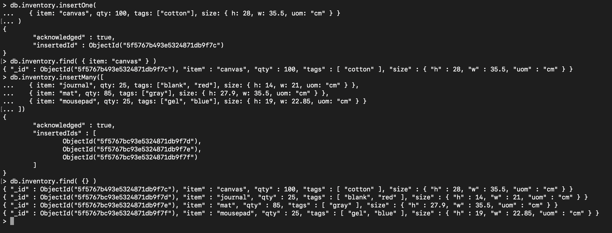
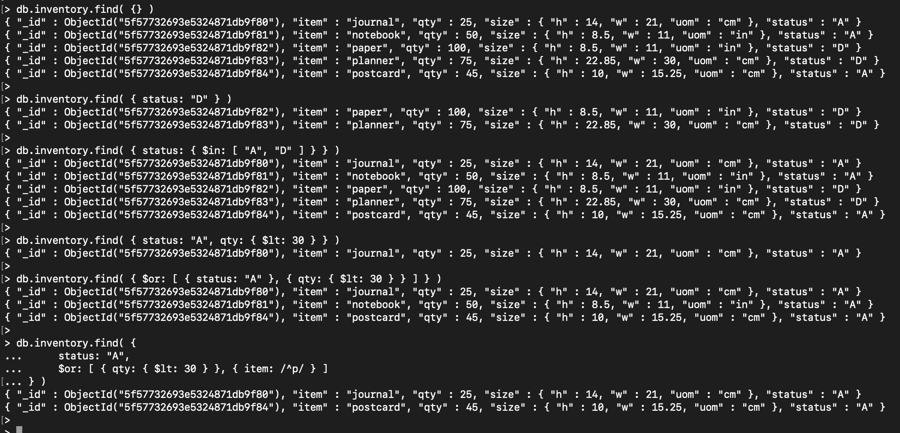
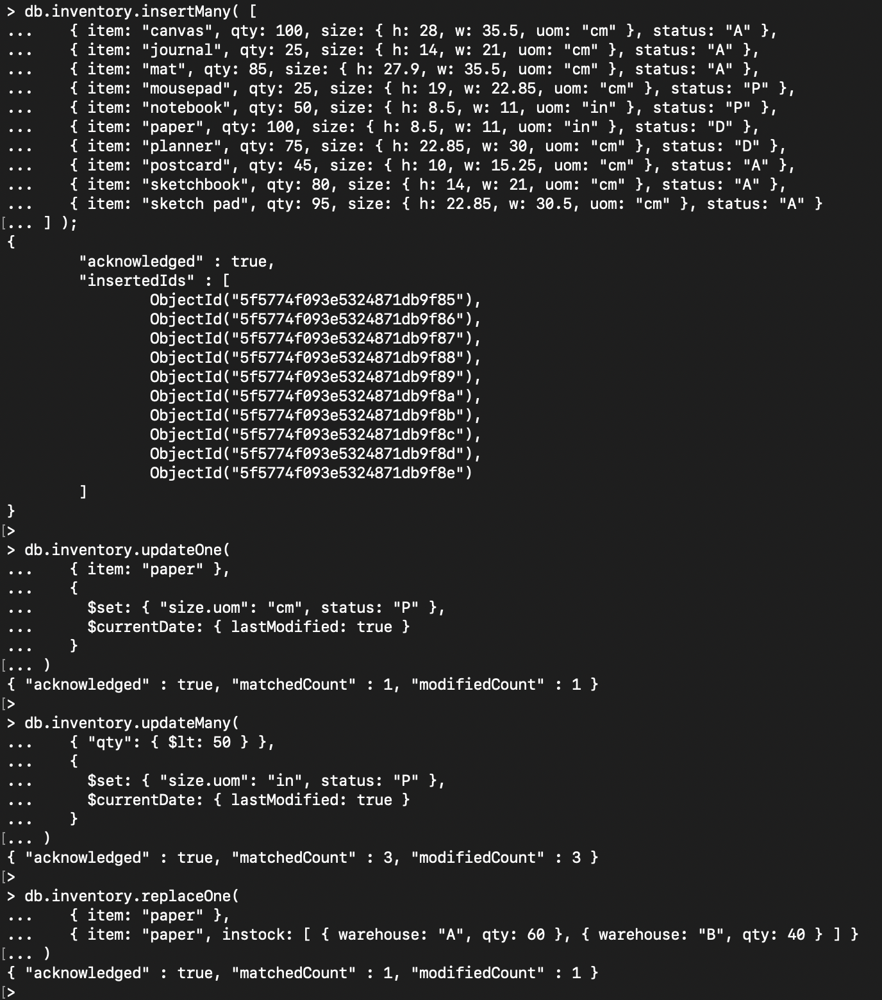
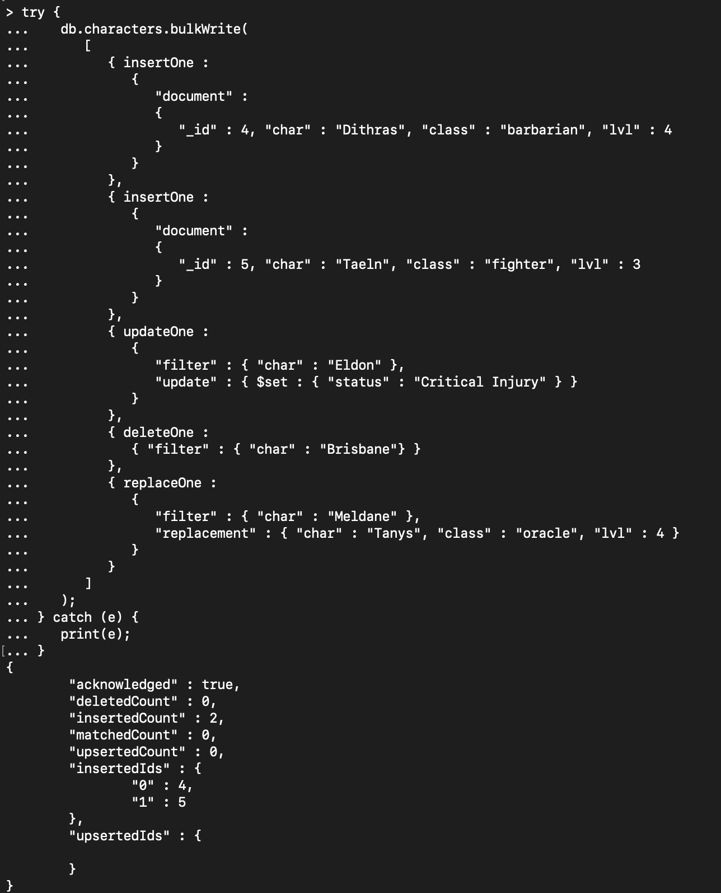

# Assignment 3

## Installation

No problems during installation. Everything went extremly smooth. 

### Installation Validation

Image not showing in GitHub. Works fine in VSCode Markdown Preview. Can be seen in images/Mongo-verify2


## Experiment 1

### Insert Document: 



### Query Documents: 



### Update Documents: 



### Delete Documents: 


### Bulk Write Operations: 




## Experiment 2

### Data

```
db.orders.insertMany([
   { _id: 1, cust_id: "Ant O. Knee", ord_date: new Date("2020-03-01"), price: 25, items: [ { sku: "oranges", qty: 5, price: 2.5 }, { sku: "apples", qty: 5, price: 2.5 } ], status: "A" },
   { _id: 2, cust_id: "Ant O. Knee", ord_date: new Date("2020-03-08"), price: 70, items: [ { sku: "oranges", qty: 8, price: 2.5 }, { sku: "chocolates", qty: 5, price: 10 } ], status: "A" },
   { _id: 3, cust_id: "Busby Bee", ord_date: new Date("2020-03-08"), price: 50, items: [ { sku: "oranges", qty: 10, price: 2.5 }, { sku: "pears", qty: 10, price: 2.5 } ], status: "A" },
   { _id: 4, cust_id: "Busby Bee", ord_date: new Date("2020-03-18"), price: 25, items: [ { sku: "oranges", qty: 10, price: 2.5 } ], status: "A" },
   { _id: 5, cust_id: "Busby Bee", ord_date: new Date("2020-03-19"), price: 50, items: [ { sku: "chocolates", qty: 5, price: 10 } ], status: "A"},
   { _id: 6, cust_id: "Cam Elot", ord_date: new Date("2020-03-19"), price: 35, items: [ { sku: "carrots", qty: 10, price: 1.0 }, { sku: "apples", qty: 10, price: 2.5 } ], status: "A" },
   { _id: 7, cust_id: "Cam Elot", ord_date: new Date("2020-03-20"), price: 25, items: [ { sku: "oranges", qty: 10, price: 2.5 } ], status: "A" },
   { _id: 8, cust_id: "Don Quis", ord_date: new Date("2020-03-20"), price: 75, items: [ { sku: "chocolates", qty: 5, price: 10 }, { sku: "apples", qty: 10, price: 2.5 } ], status: "A" },
   { _id: 9, cust_id: "Don Quis", ord_date: new Date("2020-03-20"), price: 55, items: [ { sku: "carrots", qty: 5, price: 1.0 }, { sku: "apples", qty: 10, price: 2.5 }, { sku: "oranges", qty: 10, price: 2.5 } ], status: "A" },
   { _id: 10, cust_id: "Don Quis", ord_date: new Date("2020-03-23"), price: 25, items: [ { sku: "oranges", qty: 10, price: 2.5 } ], status: "A" }
])
```

### Map Reduce Aggregation

```
db.orders.aggregate([
    { $group: { 
            _id: "$ord_date", 
            total: { $sum: "$price" }, 
            customers: { $sum: 1 }, 
        } 
    },
    { $project: {
            total: "$total",
            customers: "$customers",
            avg_per_customer: {
                $round: [
                    {
                        $divide: [
                            "$total",
                            "$customers"
                        ]
                    }, 2
                ]
            }
        }
    },
    { $sort: { 
            "_id": 1
        } 
    },
    { $out: "ord_date_avg" }
])
```

### Result

```
> db.ord_date_avg.find()
{ "_id" : ISODate("2020-03-01T00:00:00Z"), "total" : 25, "customers" : 1, "avg_per_customer" : 25 }
{ "_id" : ISODate("2020-03-08T00:00:00Z"), "total" : 120, "customers" : 2, "avg_per_customer" : 60 }
{ "_id" : ISODate("2020-03-18T00:00:00Z"), "total" : 25, "customers" : 1, "avg_per_customer" : 25 }
{ "_id" : ISODate("2020-03-19T00:00:00Z"), "total" : 85, "customers" : 2, "avg_per_customer" : 42.5 }
{ "_id" : ISODate("2020-03-20T00:00:00Z"), "total" : 155, "customers" : 3, "avg_per_customer" : 51.67 }
{ "_id" : ISODate("2020-03-23T00:00:00Z"), "total" : 25, "customers" : 1, "avg_per_customer" : 25 }
```

### Explanation

The function sums the total for all items bought on the different dates.    
Additionaly it counts the number of customers that shopped at that particular date.  
Finally it computes the average money spent by each customer  
